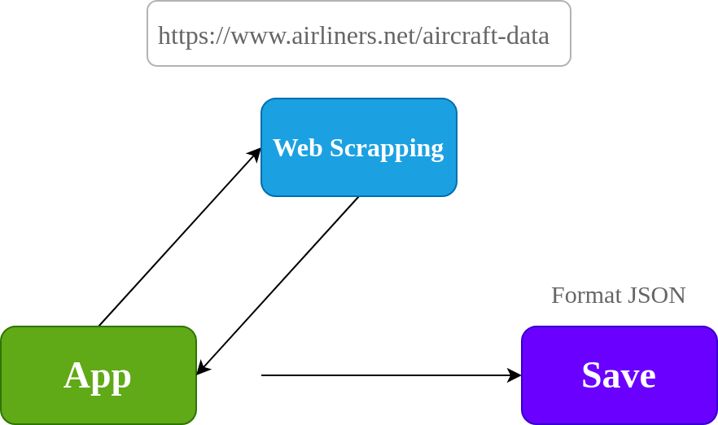
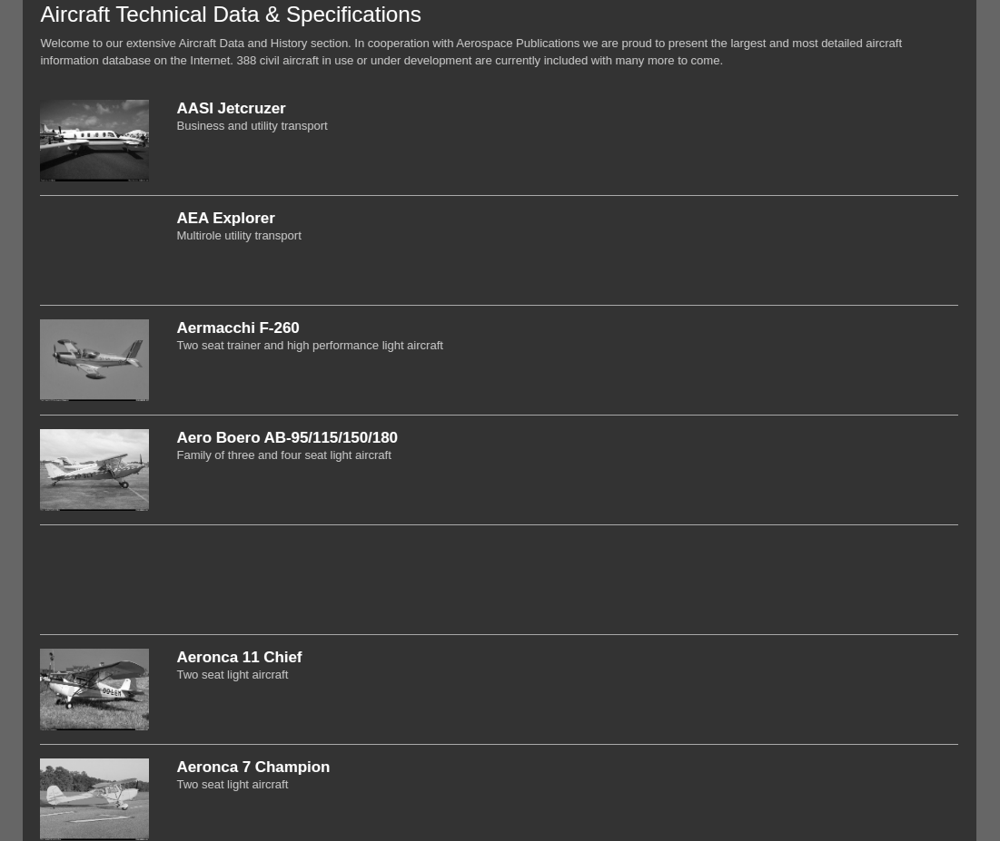
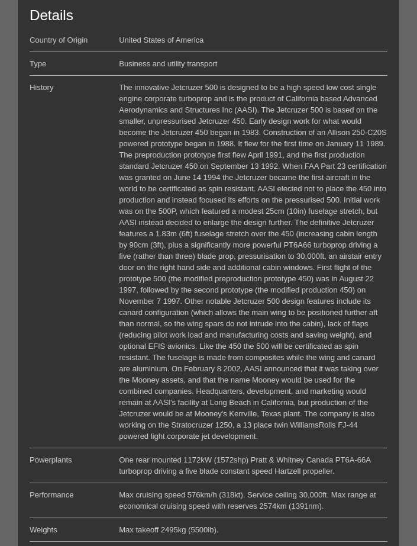

# Scrapaircraft

Tool for extract information of page X, the objective is make a 
database of aircraft for future works. Actually the project 
support to extract of data and save in format JSON.

    

The information extracted from the page covers the following sections:

- The main page, where is the list of aircraft
- The aircraft page, where is the information of aircraft

    
    

